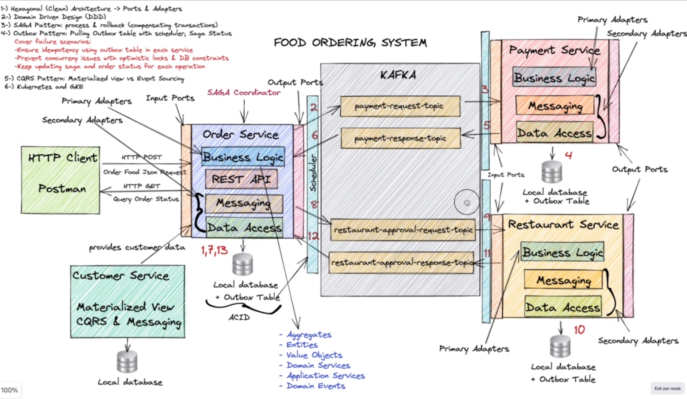
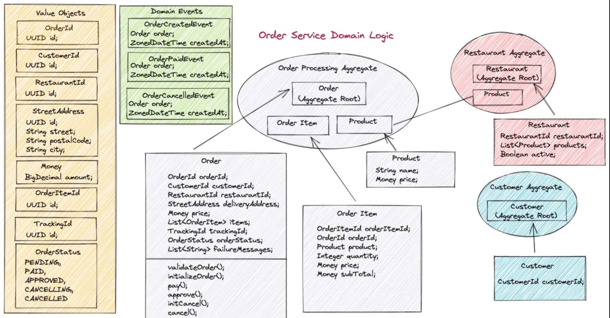
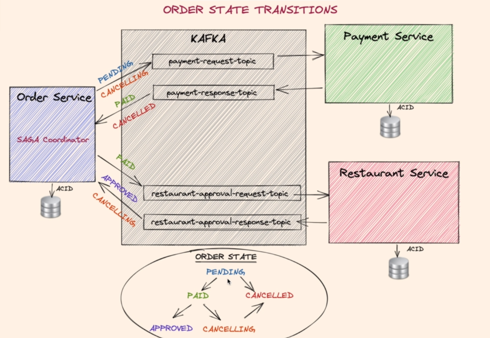

### Food Ordering System
Spring boot microservices with Clean & Hexagonal architectures, DDD, SAGA, Outbox, CQRS, Kafka.
During this project, I wrote some articles about architectures and technologies that I used in this project:
- Domain-Driven-Design(DDD) [Blog](https://itaha.hashnode.dev/microservices-domain-driven-design-ddd)
- Hexagonal architecture    [Blog](https://itaha.hashnode.dev/hexagonal-architecture)

### Order service schema

#### order-application
this is the application sites that the end users communicate with.

#### order-application
we use framework abilities to make the development easier

#### order-domain
it's a parent module.

#### order-domain-core
to separate the core domain from the application services, which are the services that expose domain methods to the outside.
We put the core logic inside this module, this will include Entities, Value Objects and domain services.
It's the most independent component including the business logic

### Order state transitions

