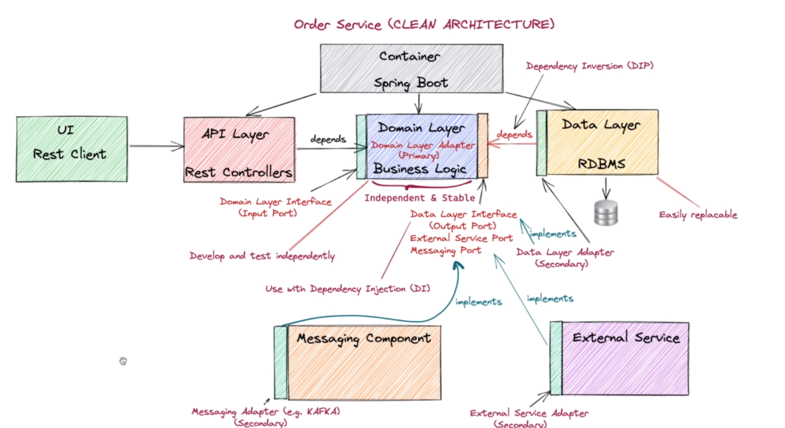

### Order service schema

## Project structure

#### order-application
this is the application sites that the end users communicate with.

#### order-domain
it's a parent module.

#### order-domain-core
to separate the core domain from the application services, which are the services that expose domain methods to the outside.
We put the core logic inside this module, this will include Entities, Value Objects and domain services.
It's the most independent component including the business logic
